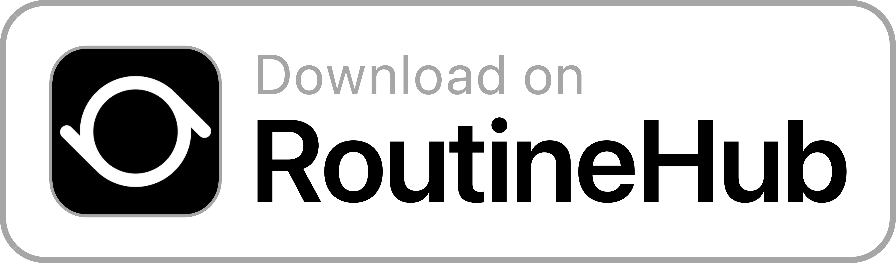

# [tycrek/ass](https://github.com/tycrek/ass) iOS Media Uploader

This iOS/Siri Shortcut uploads your media (images, videos & gifs) to your [ass](https://github.com/tycrek/ass) server (an open source [ShareX](https://github.com/ShareX/ShareX) media hosting server).

The shortcut requires configuration, which you will be prompted to do on import. You will be asked for the URL to your ass instance as well as the [auth token](https://github.com/tycrek/ass#generating-new-tokens) required to upload files to the server. At this step you can pass any other headers you'd like (instructions available in the ass [README.md](https://github.com/tycrek/ass#header-overrides)).

Either start the shortcut from your share sheet or the shortcuts app, in which case you will be prompted to select media from your Photos gallery.

If successful, the shortcut will place the URL to your shared file in your clipboard.
